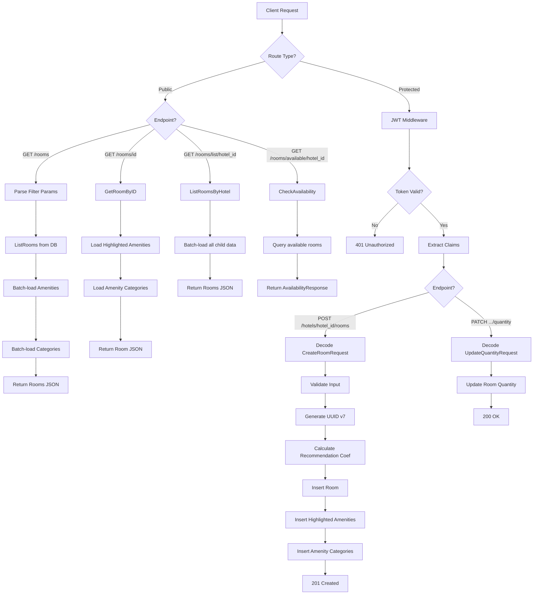
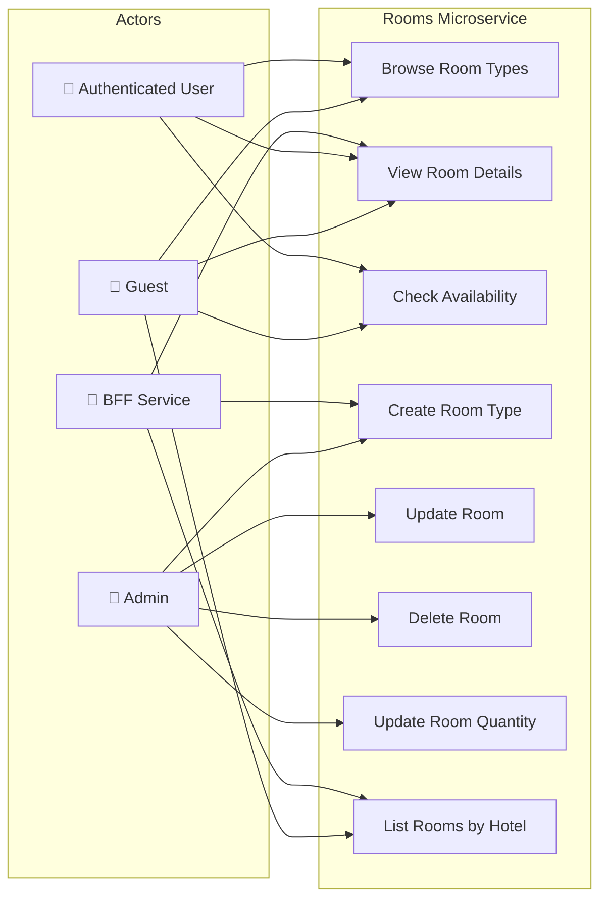
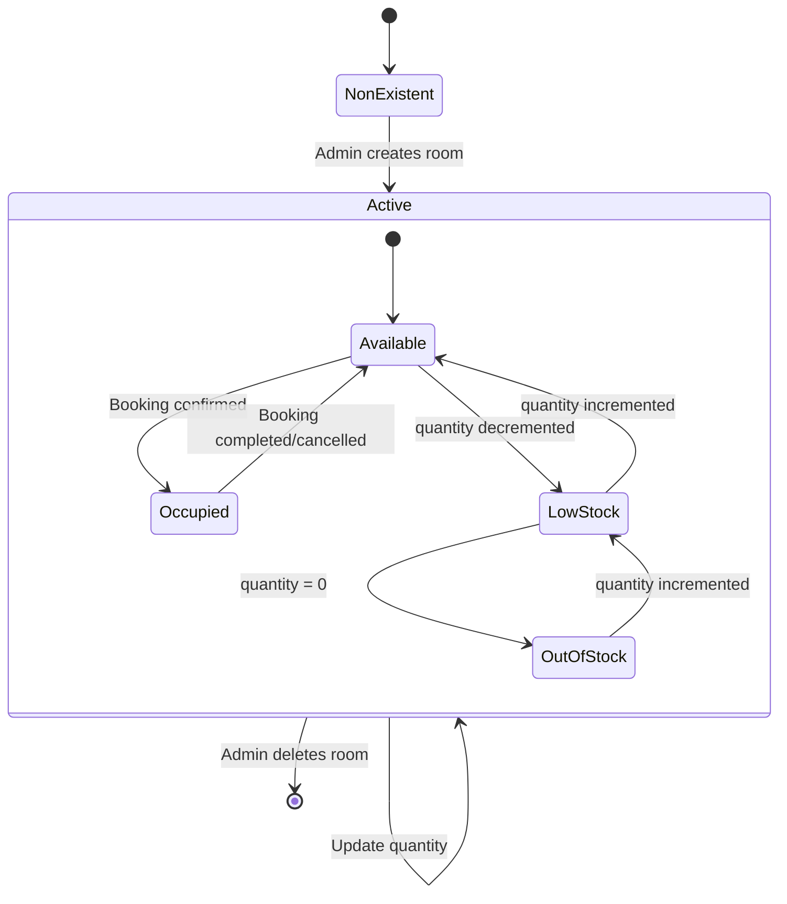
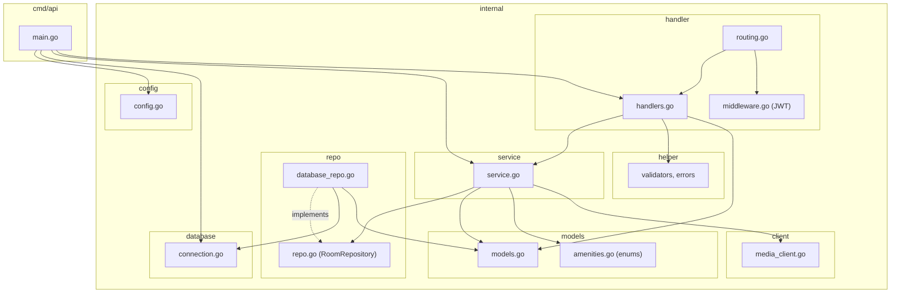

# 🛏️ Rooms Microservice

> Room inventory, amenity management, and availability service for the Hotel Reservation Platform.

## Overview

The Rooms Microservice manages **room types** within hotels, including their **highlighted amenities**, **amenity categories** (with tier-based recommendation coefficients), **availability checking**, and **quantity tracking**. It exposes both public read endpoints and admin-protected write endpoints. The recommendation coefficient system helps the frontend surface the best rooms to guests.

## Tech Stack

| Layer | Technology |
|---|---|
| Language | Go 1.25 |
| Router | [go-chi/chi](https://github.com/go-chi/chi) v5 |
| Database | PostgreSQL 16 |
| DB Driver | [pgx](https://github.com/jackc/pgx) v5 |
| Auth | JWT verification (RSA-256 public key) |
| UUID | Google UUID v7 (time-sortable) |
| Container | Docker (multi-stage Alpine build) |

## Architecture

```
app/
├── cmd/api/          # Application entrypoint
│   └── main.go
├── internal/
│   ├── client/       # Media Service HTTP client
│   ├── config/       # YAML config loader
│   ├── database/     # PostgreSQL connection pool
│   ├── handler/      # HTTP handlers, routing, JWT middleware
│   ├── helper/       # Validators, error types, response helpers
│   ├── logging/      # Structured slog logger
│   ├── models/       # Domain entities (Room, Amenities, DTOs, Enums)
│   ├── repo/         # Repository interface + PostgreSQL implementation
│   └── service/      # Business logic (CRUD + recommendation coef)
├── sql/
│   └── migrations/   # SQL migrations (rooms, highlighted_amenities, amenity_categories)
├── config.yaml
├── Dockerfile
└── go.mod
```

## API Endpoints

### Public Routes (No Authentication)

| Method | Path | Description |
|---|---|---|
| `GET` | `/health` | Liveness probe |
| `GET` | `/ready` | Readiness probe |
| `GET` | `/rooms` | List all rooms (with filters) |
| `GET` | `/rooms/{id}` | Get room by ID |
| `GET` | `/rooms/list/{hotel_id}` | List rooms for a specific hotel |
| `GET` | `/rooms/available/{hotel_id}` | Check room availability |

### Protected Routes (JWT Required)

| Method | Path | Role | Description |
|---|---|---|---|
| `POST` | `/hotels/{hotel_id}/rooms` | Admin | Create a new room type |
| `PUT` | `/hotels/{hotel_id}/rooms/{id}` | Admin | Update room details |
| `DELETE` | `/hotels/{hotel_id}/rooms/{id}` | Admin | Delete a room type |
| `PATCH` | `/hotels/{hotel_id}/rooms/{type}/{name}/quantity` | Admin | Update room quantity |

## Data Model

### `rooms` Table

| Column | Type | Description |
|---|---|---|
| `id` | UUID v7 | Primary key |
| `hotel_id` | UUID | FK → Hotel service |
| `name` | VARCHAR | Room name (e.g., "Deluxe King") |
| `type` | VARCHAR | Room type (`Single`, `Double`, `Double/Double`, `Suite`) |
| `price` | FLOAT | Price per night |
| `capacity` | INT | Maximum guest capacity |
| `description` | TEXT | Room description |
| `space_info` | TEXT | Space/size information |
| `bed_distribution` | VARCHAR | Bed layout description |
| `quantity` | INT | Number of rooms of this type |
| `amenity_count` | INT | Total amenity count |
| `recommendation_coef` | FLOAT | Auto-calculated recommendation score |
| `created_at` | TIMESTAMP | Record creation time |
| `updated_at` | TIMESTAMP | Last update time |

### `highlighted_amenities` Table

| Column | Type | Description |
|---|---|---|
| `id` | UUID v7 | Primary key |
| `room_id` | UUID | FK → `rooms.id` |
| `icon` | VARCHAR | Icon identifier (enum: `wifi`, `tv`, `ac`, etc.) |
| `text` | VARCHAR | Display text |
| `created_at` | TIMESTAMP | Record creation time |
| `updated_at` | TIMESTAMP | Last update time |

### `amenity_categories` Table

| Column | Type | Description |
|---|---|---|
| `id` | UUID v7 | Primary key |
| `room_id` | UUID | FK → `rooms.id` |
| `name` | VARCHAR | Category name (e.g., "Bathroom") |
| `description` | TEXT | Comma-separated amenity list |
| `tier` | VARCHAR | `basic`, `essential`, `comfort`, `luxury` |
| `amenity_count` | INT | Number of amenities in this category |
| `created_at` | TIMESTAMP | Record creation time |
| `updated_at` | TIMESTAMP | Last update time |

## Flow Diagram



## Use Case Diagram



## State Diagram



## Package Diagram



## Recommendation Coefficient

The recommendation coefficient is auto-calculated using the amenity tier system:

| Tier | Multiplier | Description |
|---|---|---|
| `basic` | 1.0× | Standard amenities |
| `essential` | 1.5× | Important amenities |
| `comfort` | 2.0× | Comfort-enhancing amenities |
| `luxury` | 3.0× | Premium amenities |

**Formula**: `coef = Σ(category.amenity_count × tier_multiplier)`

## Configuration

### Environment Variables

| Variable | Description |
|---|---|
| `DATABASE_URL` | PostgreSQL connection string |

### Volume Mounts (Docker)

| Host Path | Container Path | Description |
|---|---|---|
| `./keys/public.pem` | `/app/keys/public.pem` | JWT verification key |

## Port Mapping

| Context | Port |
|---|---|
| Internal (container) | `8080` |
| External (host) | `8085` |
| Database (host) | `5436` → `5432` |
